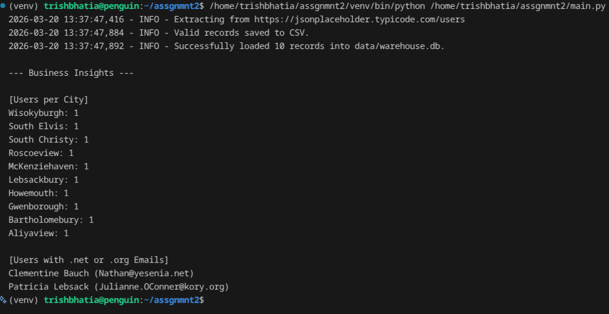
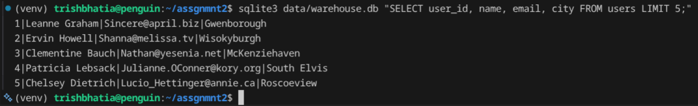

# API-to-SQLite Data Pipeline

A Python-based ETL (Extract, Transform, Load) pipeline that fetches user data from a REST API, validates it against business rules, and stores it in a structured SQLite database.

## Tech Stack
* **Language:** Python 3.11+
* **Libraries:** Pandas, Requests, SQLite3
* **Environment:** Linux (Debian/Penguin)

## Data Validation Rules
As per project requirements, the pipeline rejects records that fail the following:
* **Duplicate user_id:** Rejects non-unique IDs.
* **Email format:** Must contain an `@` symbol.
* **City null:** City field cannot be empty.
* **Zipcode:** Must be at least 5 characters long.

## Project Execution & Results

| Pipeline Execution | Database Verification |
| :--- | :--- |
|  |  |

> **Note:** The pipeline successfully processed 10 records, validating fields like `email` and `zipcode` before loading them into the `data/warehouse.db`.
